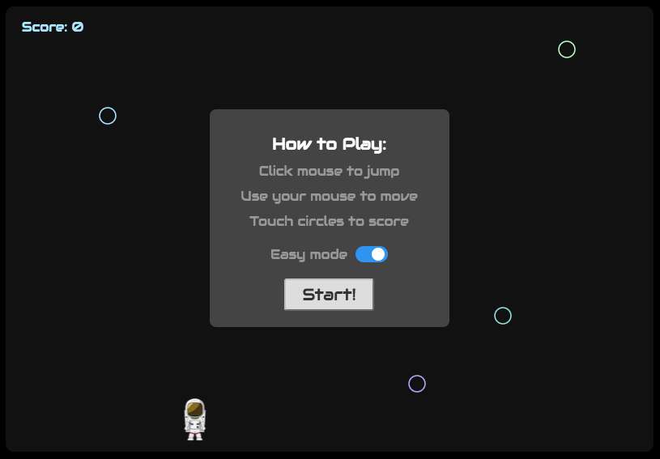

# Astrohop

[Live](https://kwokeric.github.io/astrohop/)

Astrohop is a jumping game where the aim is to use your cursor to guide an astronaut up a never-ending series of objects (circles) without falling.

## Overview

Astrohop is built with JavaScript using jQuery for interaction between the back and front end, EaselJS for interacting with the canvas and mouse position tracking, and hand-rolled physics to simulate gravity and upward movement.

User's can toggle `easy-mode` which removes the delay that normally affects the astronaut when following the cursor.

## Design

The `Game` class holds the logic for setting up and running the game based on the game's refresh rate (60fps). The `Util` file contains constants and some logic - such as `isCollidedWith` - which checks whether the astronaut has touched a circle.

## Physics

The astronaut is affected by gravity, while circles themselves are not, which allows the circles to remain suspended in the "air". Technically, each circle move downwards in unison when the astronaut collides with a circle. Also, when Matt Damon makes contact with a circle, he doesn't actually collide with it - he passes straight through the circle and gains vertical velocity. Damon's lateral movement is dictated by the cursor. When the player moves the mouse, the astronaut follows the cursor with or without a delay, depending on the selected settings.
